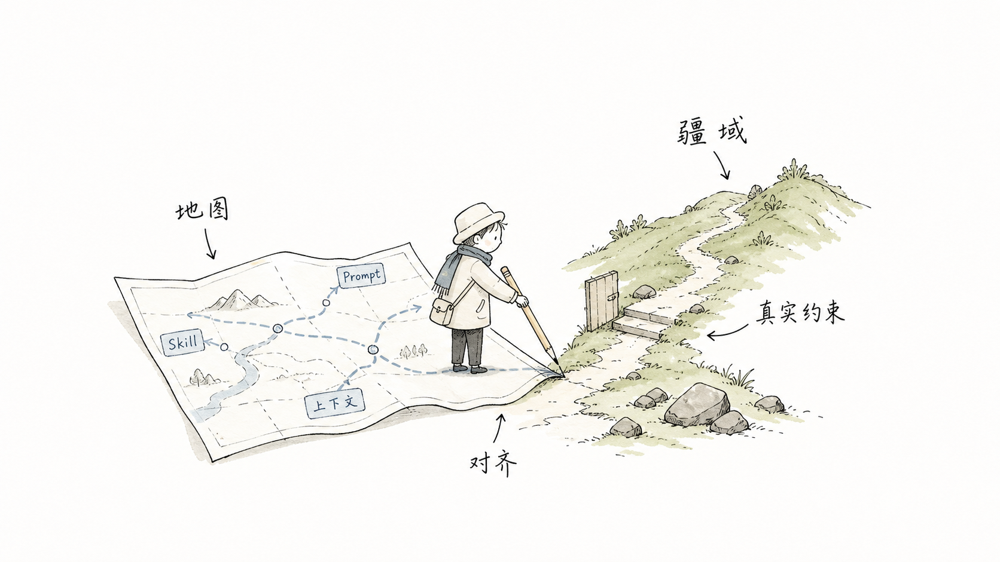

# Harness Interview Workflow

> Slow the agent down before expensive work. Turn vague intent into a structured interview, a safer plan, and an approval-gated execution path.

[🇺🇸 English](README.md) · [🇨🇳 简体中文](README.zh-CN.md) · [🇯🇵 日本語](README.ja-JP.md) · [🇰🇷 한국어](README.ko-KR.md) · [Live multilingual showcase](https://2023anita.github.io/harness-interview-workflow/)


## Why This Exists

The better AI models become, the more expensive vague instructions become.

Harness Interview Workflow is a Codex skill for the moment before execution: when the task is complex, risky, fuzzy, or likely to touch publishing, repositories, research, files, workflows, or approval gates.

Instead of rushing into implementation, the workflow asks:

- What do we already know?
- What do we know we do not know?
- What obvious context did we forget to say out loud?
- What could be an unknown unknown?
- Which answers would change architecture, risk, deliverable shape, or verification?



## Animated Architecture

The workflow is now mapped as a Lanshu-style animated architecture diagram: task signals flow into the harness core, pass through blindspot scanning and interview packets, stop at an approval gate, and then move into reusable deliverables.


## The Core Loop

1. Restate the goal and likely deliverable.
2. Run a blindspot scan.
3. Ask only the next 1-3 highest-leverage questions.
4. Classify references before using them.
5. Propose 2-3 routes.
6. Wait for explicit approval before execution.
7. Maintain implementation notes when execution deviates.
8. Deliver evidence, verification, and a small after-action quiz.


## What Makes It Different

Most prompt templates make the model sound more confident. This workflow makes the model more accountable.

It is designed for:

- plan-before-execution tasks
- reusable workflow creation
- repository and GitHub work
- publishing workflows
- research and writing tasks
- Obsidian or local-file production
- approval-gated automation
- tasks where the cost of being confidently wrong is high

## Install

Copy the skill folder into your Codex skills directory:

```bash
cp -R skills/harness-interview-workflow ~/.codex/skills/
```

Then call it by name in a Codex task:

```text
Use harness-interview-workflow. Do a blindspot scan first. Ask only the highest-leverage questions before planning.
```

## Quick Start Prompt

```text
Use harness-interview-workflow.

Do not execute yet.
First:
1. Restate my goal.
2. Run the four-part blindspot scan.
3. Ask only 1-3 questions whose answers would change architecture, risk, deliverable shape, or verification.
4. Give me route options.
5. Wait for my explicit approval before execution.
```

## Blindspot Scan Template

```text
Known knowns:
Known unknowns:
Unknown knowns:
Unknown unknowns:
Highest-risk misunderstanding:
Smallest next move:
```


## Approval Language

The skill treats actions such as repository creation, commit, push, publishing, deleting files, calling production APIs, or sharing private data as approval-gated actions.

Recommended confirmation:

```text
Confirm execution. Use the recommended route.
```

## Repository Contents

```text
skills/harness-interview-workflow/SKILL.md
templates/
examples/
docs/index.html
assets/illustrations/
```

## GitHub Pages

The README gives direct language entry points. The GitHub Pages site provides a real no-refresh language switcher for English, Chinese, Japanese, and Korean.

[Open the multilingual showcase](https://2023anita.github.io/harness-interview-workflow/)

## License

MIT
